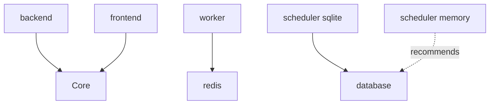

## Command Syntax

```bash
aegis components
```

## Description

List all available components and their dependencies. This command helps you discover what infrastructure components you can add to your Aegis Stack project.

## Arguments

None.

## Options

None.

## Example Output

```bash
$ aegis components

CORE COMPONENTS
========================================
  backend      - FastAPI backend server (always included)
  frontend     - Flet frontend interface (always included)

INFRASTRUCTURE COMPONENTS
========================================
  redis        - Redis cache and message broker
               Recommends: worker

  worker       - Background job worker with Dramatiq
               Requires: redis

  scheduler    - Scheduled task execution with APScheduler
               Recommends: database

  database     - SQLite database with SQLAlchemy ORM

Use 'aegis init PROJECT_NAME --components redis,worker' to select components
```

## Component Details

### Core Components

Core components are always included in every Aegis Stack project:

<CardGroup cols={2}>
  <Card title="Backend" icon="server">
    FastAPI backend server with:
    - RESTful API endpoints
    - Automatic OpenAPI docs
    - Async request handling
    - CORS middleware
    - Health check endpoints
  </Card>
  <Card title="Frontend" icon="browser">
    Flet frontend interface with:
    - Python-based UI
    - Hot reload in dev mode
    - Responsive layouts
    - Material Design components
  </Card>
</CardGroup>

### Infrastructure Components

Optional components you can add:

#### Redis

```yaml
Name: redis
Description: Redis cache and message broker
Requires: None
Recommends: worker
Use Cases:
  - Caching API responses
  - Session storage
  - Rate limiting
  - Message queue for workers
```

#### Worker

```yaml
Name: worker
Description: Background job worker with Dramatiq
Requires: redis
Recommends: None
Use Cases:
  - Send emails
  - Process images
  - Generate reports
  - Import/export data
  - Long-running tasks
```

#### Scheduler

```yaml
Name: scheduler
Description: Scheduled task execution with APScheduler
Requires: None
Recommends: database (for persistence)
Use Cases:
  - Cron jobs
  - Periodic cleanup
  - Scheduled reports
  - Data synchronization
  - Automated backups
```

#### Database

```yaml
Name: database
Description: SQLite database with SQLAlchemy ORM
Requires: None
Recommends: None
Use Cases:
  - User data
  - Application state
  - Persistent storage
  - Relational data
  - Migrations with Alembic
```

## Dependency Resolution

<Note>
Aegis automatically resolves component dependencies:

- Adding **worker** automatically adds **redis**
- Adding **scheduler[sqlite]** automatically adds **database**
- Recommendations are shown but not auto-added
</Note>

### Dependency Graph



## Component Selection

You can select components in several ways:

### During init (interactive)

```bash
aegis init my-app
# Interactive menu appears
```

### During init (command line)

```bash
aegis init my-app --components redis,worker,scheduler
```

### After init

```bash
aegis add scheduler
aegis add worker,database
```

## Component Combinations

### Common Patterns

<CardGroup cols={2}>
  <Card title="Minimal API" icon="server">
    ```bash
    aegis init my-app --no-interactive
    ```
    Components: `backend`, `frontend`
  </Card>
  <Card title="API + Database" icon="database">
    ```bash
    aegis init my-app -c database -ni
    ```
    Components: `backend`, `frontend`, `database`
  </Card>
  <Card title="Job Processor" icon="gear">
    ```bash
    aegis init my-app -c redis,worker -ni
    ```
    Components: `backend`, `frontend`, `redis`, `worker`
  </Card>
  <Card title="Full Stack" icon="layer-group">
    ```bash
    aegis init my-app -c redis,worker,scheduler,database -ni
    ```
    All components included
  </Card>
</CardGroup>

### Recommended Combinations

**Web API with Background Jobs:**
```bash
aegis init api --components redis,worker,database --no-interactive
```

**Scheduled Task Runner:**
```bash
aegis init scheduler-app --components scheduler[sqlite],database --no-interactive
```

**Real-time Application:**
```bash
aegis init realtime-app --components redis,worker,scheduler,database --no-interactive
```

## Component Details

### Redis Component

**Files added:**
- `app/redis/client.py` - Redis connection manager
- `app/redis/config.py` - Redis configuration
- `tests/redis/test_client.py` - Redis tests

**Docker service:**
```yaml
redis:
  image: redis:7-alpine
  ports:
    - "6379:6379"
```

**Dependencies:**
```toml
redis = "^5.0.0"
```

### Worker Component

**Files added:**
- `app/worker/tasks.py` - Task definitions
- `app/worker/config.py` - Worker configuration
- `app/worker/__main__.py` - Worker entrypoint
- `tests/worker/test_tasks.py` - Task tests

**Dependencies:**
```toml
dramatiq = {extras = ["redis"], version = "^1.17.0"}
```

**CLI command:**
```bash
my-app worker  # Start worker process
```

### Scheduler Component

**Files added:**
- `app/scheduler/jobs.py` - Job definitions
- `app/scheduler/config.py` - Scheduler configuration
- `app/scheduler/__main__.py` - Scheduler entrypoint
- `tests/scheduler/test_jobs.py` - Job tests

**Dependencies:**
```toml
apscheduler = "^3.10.0"
```

**CLI command:**
```bash
my-app scheduler  # Start scheduler process
```

### Database Component

**Files added:**
- `app/database/session.py` - Database session
- `app/database/base.py` - Base model
- `app/database/config.py` - Database configuration
- `alembic/` - Migration directory
- `alembic.ini` - Alembic configuration

**Dependencies:**
```toml
sqlalchemy = "^2.0.0"
alembic = "^1.13.0"
```

**CLI commands:**
```bash
make migrate        # Run migrations
make migration      # Create new migration
```

## Next Steps

After reviewing components:

1. **Create a project:** [`aegis init`](/cli/init)
2. **Add components:** [`aegis add`](/cli/add)
3. **View services:** [`aegis services`](/cli/services)

## Related Commands

- [`aegis init`](/cli/init) - Initialize new project with components
- [`aegis add`](/cli/add) - Add components to existing project
- [`aegis remove`](/cli/remove) - Remove components from project
- [`aegis services`](/cli/services) - List available services
